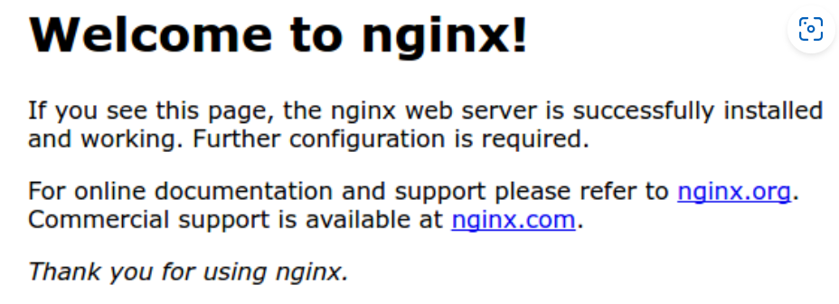

[
](https://aws.amazon.com/)


# Host a Website in Amazom Web Service(aws) 

## Description :
In this article I am giving practical process to host a Ubuntu Nginx server in aws Ubuntu EC2 Instance. You need a aws account and a local Ubuntu Machine.I install Ubuntu envirionment in Windows via wsl.

## aws account setup :

1. Creating an aws account from [here](https://aws.amazon.com/)
2. Creating a Ubuntu 24.04 LTS EC2 Instance and connect and run then install NGINX and run following way
* N.B : Don't forget to open port 80 and 443 port during ec2 creation process.Generally default ssh port is open but you need to check http as wel as https port also.
3. After creating Ubuntu EC2 Instances Run following commands in web based EC2 Terminal

```bash
    sudo apt update
    sudo apt upgrade
    sudo apt autoclean
    sudo apt autoremove
    sudo apt install ssh
```

## Installing and Run NGINX Server in Ubuntu 24.4 LTS

### SSH Conection:

If You are in 
    then don't need to install wsl but may need to install ssh by ```sudo apt install ssh``` and follow.

    If you are in 
 then you need to install Ubuntu system in your windows machine otherwise you are not able to access all bash commands in Windows terminal.

    You need to run following commands in your Windows Terminal which is started as '**Run as Administrator**' 

    ```bash
        wsl --install
    ```
    Which give available windows sub system option then install ubuntu by following command and install the distro in current directory
    ```bash
        wsl --install -d <Distro>
    ```
    Then Set username and password now your machine is ready for ssh

    One important thing supposo You want to change directory in a windows path "B:\Web_Projects\aws_project" then you need to type

    ```bash
        cd /mnt/b/Web_Projects/aws_project #add /mnt/ before all windows path
    ```

    * SSH Connection :
        Suppose You have created and downloaded "keypair.pem" and your public dns id is public_dns then 
    ```bash
        cd keypair.pem_directory
        chmod 400 "keypair.pem" #making executable
        sudo apt uupdate #for updating packages
        sudo apt upgrade -y #for upgrading packages
        sudo apt autoremove -y #for remove broken packages
        sudo apt autoclean -y #clean broken packages
        sudo apt install ssh #installing ssh in system
        sudo ssh -i "keypair.pem" public_dns #access remotely ec2
    ```

    If You see ```ssh: connect to host ec2-**-***-***-***.ap-****-1.compute.amazonaws.com port 22: Network is unreachable``` then check network connection, keyvalue pair file location.
    
----------------------------------------------

## NGINX server setup
After making successfull ssh connection with your local linux machine and aws ec2 then run this commands.

1. Installing nginx 

    ```bash
    sudo apt update
    sudo apt upgrade
    sudo apt install nginx
    ```

2. List of applications are allow by ufw(Firewall service)
    ```bash
    sudo ufw app list

    Output
    Available applications:
    Nginx Full
    Nginx HTTP
    Nginx HTTPS
    OpenSSH
    ```
    

3. Allowing Traffic only on port 80 . If you want to open 443 then you need to type ```sudo ufw allow 'Nginx Full'```
    ```bash
    sudo ufw allow 'Nginx HTTP'
    sudo ufw enable
    ```

4. Checking Status
    ```bash
    sudo ufw status
    Output
    Status: active

    To                         Action      From
    --                         ------      ----
    OpenSSH                    ALLOW       Anywhere                  
    Nginx HTTP                 ALLOW       Anywhere                  
    OpenSSH (v6)               ALLOW       Anywhere (v6)             
    Nginx HTTP (v6)            ALLOW       Anywhere (v6)
    ```

    If output is shown ```inactive``` then you need to enable ufw in your instance by ```sudo ufw enable``` . After that your EC2 instance not work in browser then you need to access the EC2 instance by ssh through Ubuntu shell.

    


5. Checking Web Server

    ```bash
    systemctl status nginx

    Output
    ● nginx.service - A high performance web server and a reverse proxy server
    Loaded: loaded (/lib/systemd/system/nginx.service; enabled; vendor preset: enabled)
    Active: active (running) since Fri 2020-04-20 16:08:19 UTC; 3 days ago
        Docs: man:nginx(8)
    Main PID: 2369 (nginx)
        Tasks: 2 (limit: 1153)
    Memory: 3.5M
    CGroup: /system.slice/nginx.service
            ├─2369 nginx: master process /usr/sbin/nginx -g daemon on; master_process on;
            └─2380 nginx: worker process
    ```

6. Get Web Server Public IP
    ```bash
    curl -4 icanhazip.com
    ```

7. See Your Website on ```http://your_server_ip```

8. You will see

    

Success! Congratulations your public website is  live.

## Add Domain in Your webservice:

10. First you need to buy a domain from domain selling portal as for example I have purchase a domain from [here](https://www.namecheap.com/) with cheap price 101 rupee for one year. You can try Godady.com . Once There was Freenom site which gave free domain for one year but now I am not able to get a free domain from there. Custom Webpage with custom domain 'your_domain'.
```bash
    sudo mkdir -p /var/www/your_domain/html
    sudo chown -R $USER:$USER /var/www/your_domain/html
    sudo chmod -R 755 /var/www/your_domain
    sudo nano /var/www/your_domain/html/index.html
```
put custom webpage ```index.html``` file inside of /var/www/your_domain/html/

```
    <html>
    <head>
        <title>Welcome to your_domain!</title>
    </head>
    <body>
        <h1>Success!  The your_domain server block is working!</h1>
    </body>
</html>
```
```CTRL+X``` to save the file in nano editor.

```bash
    sudo nano /etc/nginx/sites-available/your_domain
````

Change your_domain with actual domain name.

```bash
    server {
        listen 80;
        listen [::]:80;

        root /var/www/your_domain/html;
        index index.html index.htm index.nginx-debian.html;

        server_name your_domain www.your_domain;

        location / {
                try_files $uri $uri/ =404;
        }
    }
```
Creating a link of /etc/nginx/sites-available/your_domain into etc/nginx/sites-enabled/ location.

```bash
    sudo ln -s /etc/nginx/sites-available/your_domain /etc/nginx/sites-enabled/
```

```bash
    sudo nano /etc/nginx/nginx.conf
```

remove ```#``` in front of ```server_names_hash_bucket_size```.

```bash
    sudo nginx -t #Checking nginx syntax

    sudo systemctl restart nginx #restart nginx
```

## Server Log
- /var/log/nginx/access.log: Every request to your web server is recorded in this log file unless Nginx is configured to do otherwise.

- /var/log/nginx/error.log: Any Nginx errors will be recorded in this log.


## Credit


## For Question :


---
